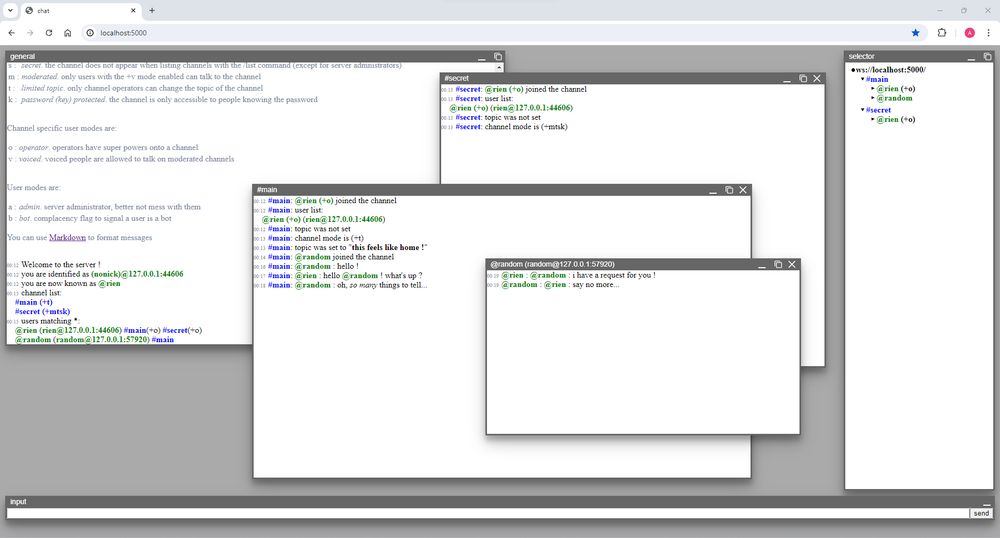

# ws-chat
An IRC like online chat running in your web browser using WebSockets

**A live demo is accessible here: [http://stochastique.io/ws-chat/](http://stochastique.io/ws-chat/)**

## Running the chat server

The chat server runs with node.js. After [installing node](https://nodejs.org/en/download/package-manager), execute the server by typing on a command line:

> `node server.js`

The server listens to **port 80** by default. However, you can change this port on the command line:

> `node server.js 5000`

You can now open a browser and browse to the url of the server, the server will display the client interface.

## Client interface

## Using the chat

Command help:

> **/help** : show the help message
> **/connect** : connect to the chat server at this location  
> **/connect \<host:port>** : connect to a chat server at the specified location  
> **/ident** : ask for your own identification string  
> **/motd** : display the server message of the day  
> **/motd \<message>** : set the server message of the day (requires: admin)  
> **/time** : show the server local time  
> **/nick \<nickname>** : set the nickname you will be yelled at  
> **/list** : list all channels on this server   
> **/users <pattern>** : list all visible users matching the specified pattern  
> **/join <#channel> [\<password>]** : join a channel and participate ! if the channel does not exist, it is automatically created  
> **/topic <#channel>** : show the current topic of the specified channel  
> **/topic <#channel> \<topic...>** : set the topic of the specified channel  
> **/msg <#channel> \<message...>** : send a message to the specified channel  
> **/msg <@user> \<message...>** : send a private message to the specified user  
> **/leave <#channel> [\<reason>]** : leave the channel. the channel is automatically destroyed when the last particiapnt leaves  
> **/mode <#channel>** : query modes for this channel  
> **/mode <#channel> [+|- \<channel modes>] [\<password>]** : set modes for this channel. password is only required when setting the k mode  
> **/mode <#channel> <@users> [+|- \<channel user modes>]** : set modes for all matching users on this channel  
> **/mode <@users> [+|- \<user modes>]** : set global modes for those matching users  
> **/kick <#channel> <@users> [\<reason>]** : kick some people out of a channel (requires: operator, admin)  
> **/wall <@users> <message...>** : send a wall notice to all matching users (requires: admin)  
> **/select <#channel>** : makes the specified channel the active channel. everything you type in the input box will be sent to this channel  

Differentiate users by using an extended name syntax: @nick\<#channel>\<@host:port>. example: 
> @test  
> @test#channel  
> @test@195.52.74.10:25642  
> @test#channel@195.52.74.10:25642

some commands (*users*, *mode*, *kick*, *wall*) accept a wildcard pattern: the command is applied to all users matching the pattern. Wildcards are * and ?, escape a wildcard by preceding it with \\.
                    
Channel modes are:

> **s** : *secret*. the channel does not appear when listing channels with the /list command (except for server admnistrators)  
> **m** : *moderated*. only users with the +v mode enabled can talk to the channel  
> **t** : *limited topic*. only channel operators can change the topic of the channel  
> **k** :  *password (key) protected*. the channel is only accessible to people knowing the password  

Channel specific user modes are:

> **o** : *operator*. operators have super powers onto a channel  
> **v** : *voiced*. voiced people are allowed to talk on moderated channels  

User modes are:
> **a** : *admin*. server administrator, better not mess with them  
> **b** : *bot*. complacency flag to signal a user is a bot  

You can use [Markdown](https://commonmark.org/help/) to format messages
